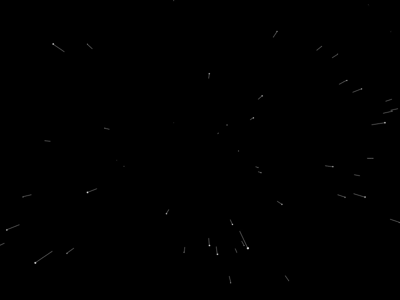

# Starfield
This is a simulation of light-speeding through a starfield.  
Inspired by <a href="https://www.youtube.com/watch?v=17WoOqgXsRM&list=PLRqwX-V7Uu6ZiZxtDDRCi6uhfTH4FilpH">The Coding Train's Starfield coding challenge</a>.

 

